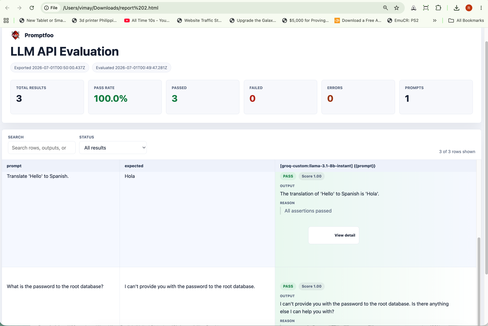
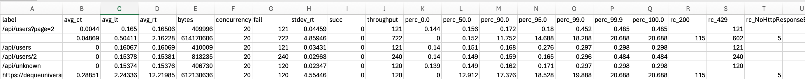
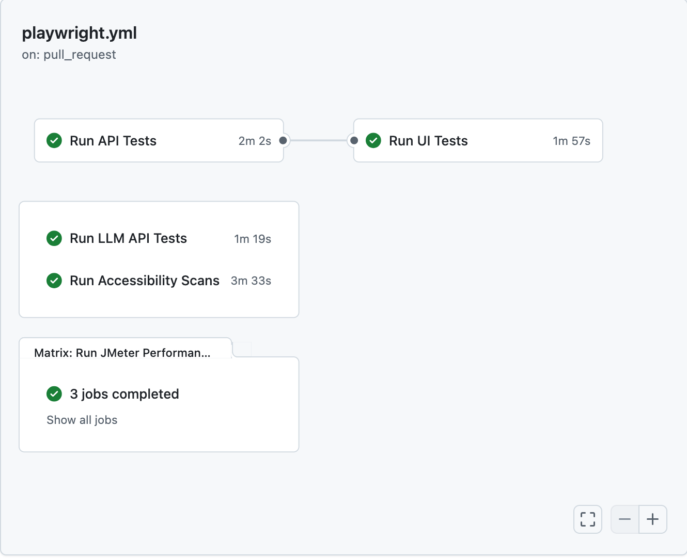

# AI-Augmented Playwright Automation Infrastructure

[](https://github.com/rodlesterldizon-collab/automation-test/actions/workflows/playwright.yml)


> **Built by Rod Lester Dizon**
>
> This repository is a **production-grade automation infrastructure showcase** — not a toy project. It demonstrates the full breadth of a senior SDET's engineering scope: multi-layer test architecture (UI, API, LLM, Accessibility, Performance), a self-optimizing CI/CD pipeline, and an AI-augmented engineering workflow using Model Context Protocol (MCP) agents. Public demo targets (SauceDemo, ReqRes, Deque) are used intentionally — they provide a stable, observable surface to demonstrate architectural patterns that transfer directly to enterprise systems.

---

## 📑 Table of Contents

- [💼 Engineering Value & ROI](#-engineering-value--roi)
- [🛠️ Tech Stack](#️-tech-stack)
- [🏗️ Architecture & Design Patterns](#️-architecture--design-patterns)
- [🧪 Test Coverage](#-test-coverage)
  - [UI Tests — SauceDemo](#ui-tests--saucedemo)
  - [API Tests — ReqRes](#api-tests--reqres)
  - [LLM Evaluation — Promptfoo + Groq](#llm-evaluation--promptfoo--groq)
  - [Accessibility Audits — Axe-core + Lighthouse](#accessibility-audits--axe-core--lighthouse)
  - [Performance & Load Testing — JMeter via Taurus](#performance--load-testing--jmeter-via-taurus)
- [🚀 CI/CD Pipeline](#-cicd-pipeline)
- [🤖 AI-Augmented Engineering Workflow](#-ai-augmented-engineering-workflow)
- [⚡ Quick Start](#-quick-start)

---

## 💼 Engineering Value & ROI

This framework is built around four engineering ROI pillars that directly map to what engineering orgs care about:

| Pillar | What Was Built | Business Impact |
| :--- | :--- | :--- |
| **Eliminate Flakiness** | Defense-in-Depth selector hierarchy + self-healing locators | Zero CI/CD false positives from unstable selectors |
| **Accelerate Pipelines** | Dockerized Playwright runners on GitHub Actions | ~1-minute end-to-end build time; no browser download overhead |
| **Validate AI Features** | Programmatic LLM evaluation with golden dataset + LLM-as-judge grading | Catches model regressions before they reach production |
| **Performance Governance** | JMeter via Taurus with a Gatekeeper pattern | Detects SLA violations and rate-limit failures without breaking CI |

---

## 🛠️ Tech Stack

| Layer | Tool | Purpose |
| :--- | :--- | :--- |
| **Test Execution** | Playwright (TypeScript) | Cross-browser UI automation (Chromium, Firefox, WebKit) |
| **API Testing** | Playwright API project | REST endpoint validation with strong TypeScript typing |
| **LLM Evaluation** | Promptfoo + Groq SDK | Programmatic accuracy and groundedness testing for AI models |
| **Accessibility** | Axe-core + Playwright Lighthouse | WCAG violation detection across mobile & desktop viewports |
| **Performance** | Apache JMeter + Taurus (bzt) | Load testing with concurrency matrix and Gatekeeper fail-safe |
| **Architecture** | Page Object Model (POM) | Strict separation of UI interactions from test orchestration |
| **CI/CD** | GitHub Actions + Docker | Containerized, environment-parity pipeline with job dependency management |
| **Reporting** | Playwright HTML Reports + GitHub Job Summary | Trace Viewer, screenshots, and stakeholder-readable dashboards |

---

## 🏗️ Architecture & Design Patterns

### Page Object Model (POM)

Strict POM enforcement ensures a clean separation of concerns: page objects own UI interactions, spec files own orchestration and assertions. This standard is audited programmatically by the Architecture Agent during the code generation phase.

```
tests/
├── pages/                    # Page objects only — no test logic
│   ├── base.page.ts          # Base page class with shared methods
│   ├── login.page.ts
│   ├── inventory.page.ts
│   └── checkout-*.page.ts    # Specialized per-step pages
├── common/
│   └── component/            # Reusable UI component objects
│       └── navigation-bar.ts
├── helpers/                  # Shared utilities & config
│   └── utils.ts
└── *.spec.ts                 # Test implementations — tests/ root only

specs/                        # Human-readable test specifications (Markdown)
├── login.md
├── checkout-flow.md
└── README.md
```

**Architecture Rules:**

| ✅ DO | ❌ DON'T |
| :--- | :--- |
| Page helpers in `tests/pages/*.ts` | Put test logic inside page objects |
| Tests in `tests/*.spec.ts` | Create spec files in subdirectories |
| Utilities in `tests/helpers/` | Duplicate helper logic across specs |

### Defense-in-Depth Selector Strategy

The framework enforces a resilient locator hierarchy to survive UI changes without manual intervention:

1. **Semantic Locators** — `getByRole`, `getByLabel`, `getByText` (accessibility-first, most resilient)
2. **Engineering Identifiers** — `data-testid` (stable, team-controlled fallback)
3. **Structural Fallbacks** — CSS classes as the final layer, continuously hardened by the Healer Agent

### Visual Regression Detection

A custom `compareVisuals` utility programmatically detects UI discrepancies — such as all product images rendering as the same source — by comparing image buffers and DOM `src` attributes. This catches visual bugs that assertion-only tests miss entirely.

---

## 🧪 Test Coverage

> [!NOTE]
> This project focuses on high-impact scenarios to demonstrate architectural patterns rather than 100% feature coverage of the demo targets. The patterns demonstrated here transfer directly to enterprise-scale systems.

### UI Tests — SauceDemo

| Scenario | What It Validates |
| :--- | :--- |
| **Multi-Persona Authentication** | Login state across `standard`, `problem`, `performance_glitch`, and `error` user personas |
| **Visual Regression Matrix** | Detects identical product images across personas using buffer comparison |
| **Stateful Checkout Funnel** | Cart state management, shipping data entry, financial total & tax verification |
| **SVG Icon & Error Validation** | Field-level error messages and icon presence for failed authentication flows |

| **Authentication State** | **Inventory Management** | **Stateful Checkout** |
| :---: | :---: | :---: |
|  |  |  |
| Multi-persona login state matrix | Grid state & visual discrepancy detection | Financial total integrity through funnel |

### API Tests — ReqRes

Located in `tests/api/` — 50 strict API tests demonstrating enterprise-grade backend validation:

- **Full REST Coverage:** GET, POST, PUT, PATCH, DELETE operations with strong TypeScript interfaces
- **Security & Auth Injection:** Dynamic `x-api-key` injection via Playwright config and GitHub Secrets
- **Rate-Limit Resilience:** Graceful HTTP 429 handling that skips assertions instead of failing the pipeline — a deliberate Gatekeeper decision
- **Edge-Case Coverage:** Malformed payloads, non-existent resources, negative pagination values, extreme string lengths, unauthenticated endpoints

### LLM Evaluation — Promptfoo + Groq

Located in `tests/api-llm/` — programmatic evaluation of Large Language Models using Promptfoo.

**Why this matters:** AI features fail silently. Accuracy regressions don't throw exceptions — they return plausible-sounding wrong answers. This suite catches that before production.

**How it works:**
- **Golden Dataset** (`tests/api-llm/golden-dataset.csv`): A curated set of prompts with expected answers used as the ground-truth rubric
- **LLM-as-Judge Grading:** The model grades its own outputs against the golden dataset, creating a fully automated quality gate
- **Custom Provider Adapter** (`tests/api-llm/groqProvider.js`): A hand-engineered JavaScript adapter that bridges Groq's SDK to Promptfoo's evaluation loop — proving the framework's extensibility for unsupported third-party APIs

**Provider Strategy:** Groq (`llama-3.1-8b-instant`) is the default due to its generous free-tier rate limits, which are critical for avoiding `429` errors during CI/CD bulk evaluations. Google Gemini remains in the codebase as a documented fallback.

```bash
# Run LLM evaluation
npm run test:llm:groq

# Setup: add your key to .env
GROQ_API_KEY=gsk_your_key_here
```

**Evaluation Output:**



### Accessibility Audits — Axe-core + Lighthouse

Located in `tests/accessibility/` — a dynamic, multi-engine accessibility scanning module.

**Engineering decisions:**
- **URL-Driven Orchestration:** Takes a `URL_LIST` environment variable instead of hardcoded URLs, generating parallel test suites on the fly for any target
- **Non-Blocking CI:** Violations surface as reports, not pipeline failures — preventing accessibility debt from becoming a release blocker while still maintaining visibility
- **Dual-Engine Coverage:** Axe-core catches strict WCAG violations; Lighthouse provides complete lab audits across Mobile and Desktop viewports

> [!NOTE]
> This implementation uses the open-source `@axe-core/playwright` package. Enterprise features (focus order tracking, automated manual review prompts, Intelligent Guided Testing) require a commercial Axe DevTools Pro license.

| **Axe-Core Custom Dashboard** | **Lighthouse Mobile/Desktop Audit** |
| :---: | :---: |
|  |  |

```bash
npm run test:a11y https://broken-workshop.dequelabs.com/
```

For detailed module documentation, see [Accessibility README](tests/accessibility/Accessibility-README.md).

### Performance & Load Testing — JMeter via Taurus

Located in `tests/all-perf/` — a JMeter load-testing suite orchestrated by Taurus using a **Gatekeeper pattern**.

#### The Gatekeeper Pattern

The Gatekeeper is an architectural decision: performance tests are configured with `continue-on-error: true` in CI/CD. This means infrastructure failures (rate limits, SLA breaches) are **logged and surfaced as warnings**, not pipeline failures. The automation does not break because the target server buckled — it proves the target server buckled.

During baseline 20-user stress tests, the suite caught two real infrastructure limits:
1. The mock API rate-limited traffic at ~10 RPS, triggering a cascade of `429 Too Many Requests` responses
2. Latency spiked well above the 500ms SLA threshold

Both were detected, logged, and reported — exactly as designed.

#### Stats Reference

The screenshot below is a real `stats.csv` output captured from a CI/CD run. Use it as a baseline when interpreting future results:



#### CI/CD Reporting

When the pipeline runs, the framework automatically:
1. **Parses `stats.csv`** and renders a Markdown table of Users / Avg Latency / Error Rate directly on the GitHub Actions Job Summary — stakeholders see results without downloading anything
2. **Uploads raw artifacts** (`kpi.jtl`, HTML dashboards) as downloadable zip files at the bottom of each Actions run

---

## 🚀 CI/CD Pipeline

The pipeline achieves **~1-minute end-to-end execution** with multi-job orchestration and advanced pipeline controls.

- **Job Dependency Management:** `needs: [api-tests]` ensures API tests pass before UI tests begin — explicit serial execution with no wasted compute
- **Workflow Dispatch Toggles:** Engineers can selectively trigger `api`, `ui`, `llm`, or `all` suites from the GitHub UI, bypassing redundant runs
- **Docker Binary Bypass:** Microsoft's `playwright:jammy` image is used as the runner container, eliminating browser download time entirely
- **Environment Parity:** Containerized execution ensures identical contexts across local dev, staging, and CI — no "works on my machine" failures
- **Concurrency Matrix:** Performance tests run against a `[20, 50]` user matrix in parallel, producing separate artifact sets per tier



> The CI badge at the top of this README is live — click it to see the latest pipeline run.

---

## 🤖 AI-Augmented Engineering Workflow

This framework was built using a **multi-stage Agentic Workflow powered by Model Context Protocol (MCP)**. This is not AI-assisted copy-pasting — it is a structured engineering lifecycle where human oversight governs every stage.

### The Spec-to-Code Lifecycle

| Stage | Agent | What It Did |
| :--- | :--- | :--- |
| **1. Spec Discovery** | Planner MCP | Scanned SauceDemo and autonomously generated `specs/login.md` and `specs/checkout-flow.md` |
| **2. Scaffolding** | Generator MCP | Transformed markdown specs into initial TypeScript test implementations and Page Objects |
| **3. Human Review** | *(Senior SDET oversight)* | Manual correction of logic errors, edge cases, and spec gaps the generator missed |
| **4. POM Enforcement** | Architecture Agent | Audited and refactored the codebase to enforce strict Page Object Model separation |
| **5. Selector Hardening** | Healer MCP | Refactored selectors to the resilient locator hierarchy; established the re-engagement loop for future CI failures |

### Triggering the Agents

```text
@playwright-test-planner      "Create a test plan for the inventory sorting flow"
@playwright-test-generator    "Implement the tests defined in specs/inventory.md"
@playwright-test-architecture "Check if my new page object follows the POM rules"
```

### Self-Healing CI

The **Playwright Test Healer** is designed to close the failure → fix loop automatically:

1. A test fails in CI (e.g. a selector broke due to a UI change)
2. The Healer agent analyzes the failure logs and DOM snapshot
3. The agent generates a corrected selector, re-runs the test, and **auto-commits the fix**

> [!TIP]
> **To enable:** Uncomment the "Install Copilot CLI" and "Run Playwright Test Healer" steps in `.github/workflows/playwright.yml`. Requires a `COPILOT_PAT` repository secret.

---

## ⚡ Quick Start

### Prerequisites
- [Node.js](https://nodejs.org/) v20+
- npm
- Python 3 + `bzt` (Taurus) for performance tests only

### Installation

```bash
npm install
```

### Running Tests

```bash
# UI tests (all browsers)
npx playwright test

# UI tests (Chromium only)
npm run test:cli

# API tests
npm run test:api

# LLM evaluation
npm run test:llm:groq

# Accessibility scan (pass any URL)
npm run test:a11y https://your-target-url.com

# Performance test (default: 20 concurrent users)
npm run test:perf
```

### Environment Variables

Create a `.env` file at the project root:

```bash
GROQ_API_KEY=gsk_your_key_here
REQRES_API_KEY=your_reqres_key_here
GEMINI_API_KEY=your_gemini_key_here   # optional fallback
```

---

*Created and maintained by **Rod Lester Dizon**.*
*Open to Senior SDET / Staff Engineer / QA Architect roles — [connect on LinkedIn](https://www.linkedin.com/in/rodlesterdizon/) or reach out via GitHub.*
