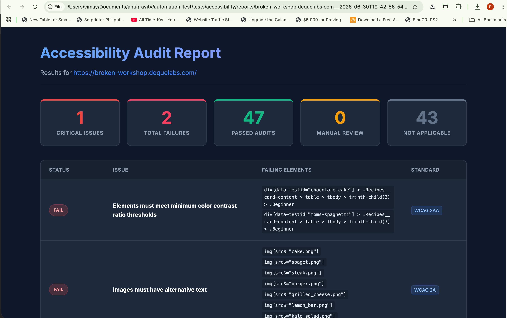
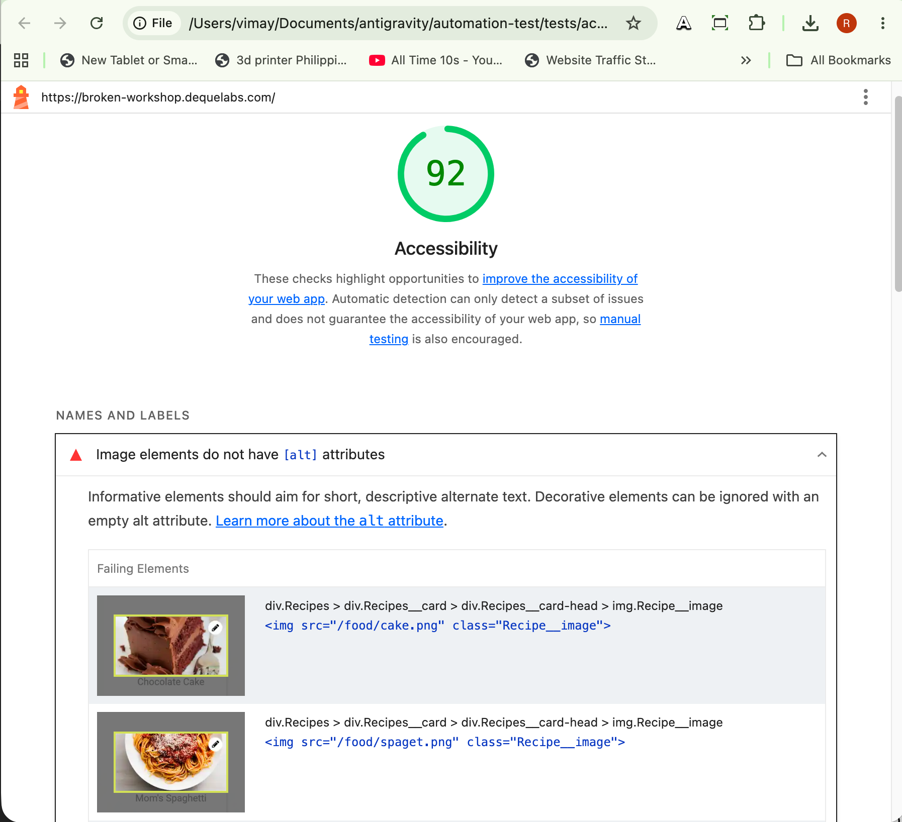
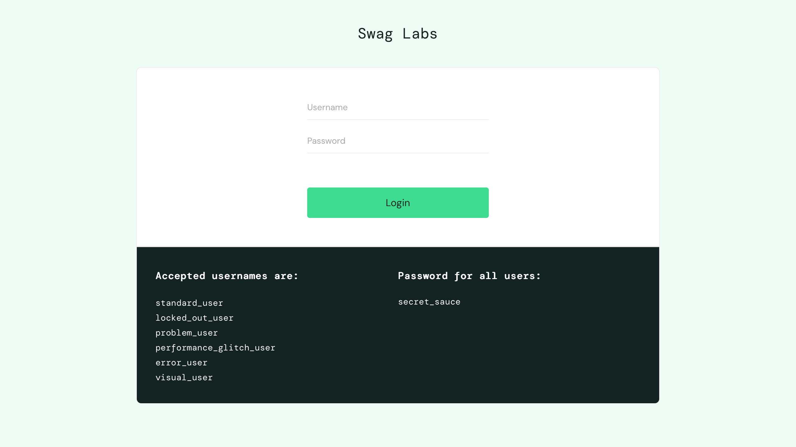
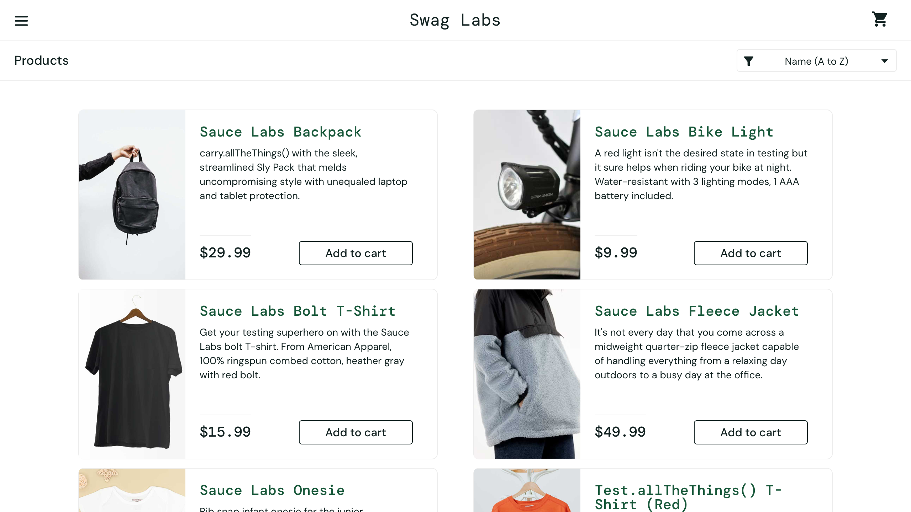
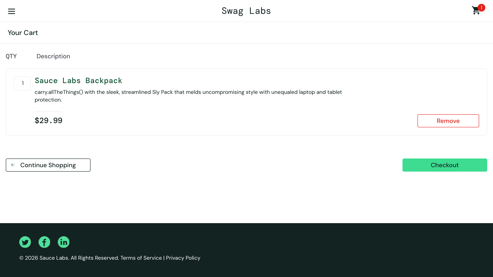

# 🚀 AI-Augmented Playwright Automation Infrastructure

[](https://github.com/rodlesterldizon-collab/automation-test/actions/workflows/playwright.yml)     

This repository is an **E2E Automation Infrastructure & AI Showcase**.

It demonstrates a robust, scalable, and self-healing engineering environment designed for enterprise-grade software delivery. This framework utilizes a mock e-commerce frontend (SauceDemo) and a mock API backend (ReqRes.in) to demonstrate advanced pipeline architecture, architectural governance, multi-layer testing (UI & API), and agentic workflows.

### 💼 Business Value & Engineering ROI
This framework is focused on building infrastructure that accelerates delivery and reduces costs by:
1. **Eliminating Flakiness:** Implementing a strict "Defense-in-Depth" selector strategy and self-healing locators to eliminate CI/CD false positives.
2. **Accelerating Pipelines:** Optimizing GitHub Actions with Dockerized Playwright runners to achieve lightning-fast ~1-minute execution times.
3. **Validating AI Models:** Implementing robust, programmatic LLM testing to ensure the accuracy and groundedness of AI features before they reach production.

Created and maintained by **Rod Lester Dizon**.

---

## 📑 Table of Contents
- [🤖 The AI-Augmented Engineering Lifecycle](#-the-ai-augmented-engineering-lifecycle)
- [🚀 CI/CD Optimization & Pipeline Controls](#-cicd-optimization--pipeline-controls)
- [🏗️ Architectural Governance & Selector Resiliency](#️-architectural-governance--selector-resiliency)
- [🛠️ Tech Stack & Patterns](#️-tech-stack--patterns)
- [🚀 Quick Start](#-quick-start)
- [🧠 LLM API Evaluation (Promptfoo)](#-llm-api-evaluation-promptfoo)
- [♿ Automated Accessibility Audits (A11y)](#-automated-accessibility-audits-a11y)
- [Git Workflow Reference](#git-workflow-reference)

---
## 🤖 The AI-Augmented Engineering Lifecycle

While I personally designed the core architecture, testing strategy, strict POM rules, and CI/CD logic, I utilized a multi-stage **Agentic Workflow using MCP (Model Context Protocol)** to rapidly scaffold the boilerplate. This demonstrates how Senior SDETs can orchestrate AI agents to achieve 10x engineering velocity on the SauceDemo UI.

1.  **Spec Discovery (The Planner MCP):** The process began with an Agentic Planner that scanned the SauceDemo target to autonomously generate comprehensive test plans, resulting in the `specs/login.md` and `specs/checkout-flow.md` files.
2.  **Automated Scaffolding (The Generator MCP):** These specs were fed into a Generator agent to produce the initial test implementations and baseline Page Objects.
3.  **Human-in-the-Loop Refinement:** As part of senior-level oversight, manual interventions were made to correct logic discrepancies and edge cases that the initial AI generation miscalculated or overlooked.
4.  **Architectural Alignment (The Architecture Agent):** A dedicated Architecture Agent was engaged to refactor and enforce strict **Page Object Model (POM)** standards, ensuring a clean separation of concerns.
5.  **Infrastructure Hardening (The Healer MCP):** Finally, the Healer agent was utilized to optimize selector strategies on the SauceDemo frontend. It refactored the suite to prioritize Playwright's recommended locators (`getByRole`, `getByLabel`, `getByTestId`) with a resilient fallback to class-based selectors, ensuring stability before re-engaging the healing loop for future CI failures.

### 🛠️ Self-Healing & Selector Resiliency
The **Playwright Test Healer** doesn't just fix broken code; it enforces a strict selector hierarchy. It prioritizes `data-testid` and user-facing attributes, establishing a secondary fallback to CSS classes only if standard locators fail, effectively creating a "defense-in-depth" selector strategy.

## 🚀 CI/CD Optimization & Pipeline Controls

The pipeline is engineered for performance, achieving **~1-minute build times** in GitHub Actions with advanced pipeline controls.

- **Multi-Job Serial Execution:** The workflow leverages `needs: [api-tests]` to ensure that API tests pass perfectly before UI tests begin, explicitly demonstrating job dependency management.
- **Workflow Dispatch Toggles:** Gives engineers manual control to conditionally trigger `api`, `ui`, or `all` suites directly from the GitHub UI, bypassing redundant runs.
- **Binary Bypass:** Utilizes Microsoft’s `playwright:jammy` Docker image, eliminating the need for slow browser binary downloads during runtime.
- **Environment Parity:** Dockerized runners ensure identical execution contexts across local, staging, and production-grade CI environments.

## 🏗️ Architectural Governance & Selector Resiliency

The codebase adheres to strict engineering standards to ensure long-term sustainability.

- **Strict Page Object Model (POM):** Enforced separation of concerns where page objects manage UI interactions while spec files handle orchestration and assertions. This standard is programmatically audited by the **Architecture Agent** during the code generation phase.
- **Defense-in-Depth Selector Strategy:** The infrastructure prioritizes a resilient locator hierarchy:
  1. **Semantic Locators:** `getByRole`, `getByLabel`, and `getByText` to ensure accessibility and user-centric testing.
  2. **Engineering Identifiers:** `data-testid` as a robust fallback for stable automation.
  3. **Structural Fallbacks:** CSS classes as a tertiary layer, hardened by the **Healer Agent** during autonomous maintenance cycles.
- **Visual Regression Matrix:** A custom `compareVisuals` utility enables programmatic detection of UI discrepancies—such as identical image sources—by comparing image buffers and DOM attributes.
- **Directory Enforcement:** Mandatory isolation of helpers, common components, and test specifications as detailed in TESTING_ARCHITECTURE.md.

---

## 🛠️ Tech Stack & Patterns
- **Framework:** Playwright (Chromium, Firefox, WebKit)
- **Language:** TypeScript
- **Architecture:** Page Object Model (POM)
- **CI/CD:** GitHub Actions with Dockerized Runners
- **Reporting:** Playwright HTML Reports with Trace Viewer & Screenshot artifacts
- **LLM Evaluation:** Promptfoo (for testing API accuracy and groundedness)
- **Logic:** Centralized Configuration & Visual Bug Detection Utilities

---

## 🚀 Quick Start

### Prerequisites
- [Node.js](https://nodejs.org/) (v20 or higher)
- npm

### Installation

```bash
# Install dependencies (including groq-sdk for LLM evaluation)
npm install

# Run all UI tests locally
npx playwright test
# Run all UI tests against Chromium
npm run test:cli

# Run tests in UI mode
npm run test:ui

# Run tests in debug mode
npx playwright test --debug

# Run LLM Evaluation tests
npm run test:llm:groq
# or npm run test:llm:gemini
```

---

## 🧠 LLM API Evaluation (Promptfoo)

Located in the `tests/api-llm/` directory, this framework includes automated evaluations for Large Language Models (LLMs) using **Promptfoo**.

### Core Configuration & Golden Dataset
- **`tests/api-llm/golden-dataset.csv`**: The "Golden Dataset" containing a rigorous set of prompts and expected answers. We use this to evaluate the model's accuracy and groundedness programmatically.
- **`tests/api-llm/promptfooconfig.yaml`**: The primary configuration file orchestrating the Promptfoo evaluation loop. It dictates the providers being tested and the assertion rubrics used for grading.

### Groq vs. Gemini
By default, the testing suite is configured to evaluate **Groq** (`llama-3.1-8b-instant`) due to its lightning-fast inference and generous free-tier rate limits, which are ideal for rapid CI/CD execution without hitting `429 Too Many Requests` errors. 

The original **Google Gemini** (`google:gemini-3.5-flash`) implementation remains in the codebase as a fallback but is heavily commented out in the `tests/api-llm/promptfooconfig.yaml` file to prevent rate-limiting during bulk Promptfoo evaluations.

#### Custom Provider Engineering
To integrate Groq natively with Promptfoo's evaluation loop, I engineered a custom JavaScript provider adapter (`tests/api-llm/groqProvider.js`). This custom script interfaces directly with the `groq-sdk`, proving the framework's extensibility to handle complex internal tools and unsupported third-party APIs.

### How to use it:
1. Ensure the Groq SDK is installed: `npm install groq-sdk`
2. Add your Groq API key to the `.env` file: `GROQ_API_KEY=gsk_your_key_here`
3. Run the evaluation: `npm run test:llm`
3. Run the evaluation: `npm run test:llm:groq`
4. The test evaluates the outputs and uses the Groq model itself as the "Judge" to grade its own answers based on an LLM rubric.

---

## ♿ Automated Accessibility Audits (A11y)

This framework includes a dedicated accessibility module capable of dynamically scanning any URL using both the open-source **Axe-core** engine and **Google Lighthouse**. 

> **⚠️ Open-Source Limitations Notice:** This implementation uses the free, open-source `@axe-core/playwright` package. While it perfectly detects statically verifiable WCAG violations, it lacks Deque's proprietary enterprise features. Complex interactive heuristics (like focus order tracking), automated manual review prompts, and Intelligent Guided Testing (IGT) require purchasing a commercial **Axe DevTools Pro** license.

### How it works
- **Dynamic Orchestration**: Instead of hardcoding URLs into specs, the module ingests a `URL_LIST` environment variable to dynamically generate parallel test suites on the fly.
- **Non-Blocking CI**: Discovering accessibility violations does *not* fail the build (exit code 0). This prevents pipeline blockages while still surfacing critical reports.
- **Multi-Engine Scanning**:
  - `axe-core`: Identifies strict programmatic WCAG violations.
  - `playwright-lighthouse`: Performs complete lab accessibility audits for both Mobile and Desktop viewports.

### Running the Scans
To execute the suite, simply run:
```bash
npm run test:a11y https://broken-workshop.dequelabs.com/
```
*(This single command automatically runs both Axe-Core and Google Lighthouse sequentially in the exact same container context).*

### Reporting
For every URL, the framework automatically generates artifacts in the `tests/accessibility/reports/` folder:
1. **Axe Premium HTML Dashboard** (Stylized view highlighting affected nodes and failing DOM element selectors)
2. **Axe Raw JSON Data**
3. **Google Lighthouse HTML Reports** (Mobile & Desktop)

#### Dashboard Examples

**Axe-Core Custom Dashboard:**  


**Lighthouse Mobile/Desktop Audit:**  


For more detailed information, please read the [Accessibility Module Documentation](file:///Users/vimay/Documents/antigravity/automation-test/tests/accessibility/README.md).

---

## Git Workflow Reference

Quick command reference for branching, committing, and merging:

### Create a New Branch
```bash
git checkout -b branch-name
# Example:
git checkout -b add-login-tests
```

### Make Changes & Commit

**Stage files:**
```bash
git add .                             # Stage all changes
git add path/to/specific/file.ts      # Stage specific file
git add .github/workflows/             # Stage entire directory
```

**Commit changes:**
```bash
git commit -m "descriptive message"
# Example:
git commit -m "test: add login flow tests"
```

### Push Branch to GitHub
```bash
git push origin branch-name
# Example:
git push origin add-login-tests
```

### Merge Branch to Main

**Step 1: Switch to main**
```bash
git checkout main
```

**Step 2: Merge your branch**
```bash
git merge branch-name
# Example:
git merge add-login-tests
```

**Step 3: Push to GitHub**
```bash
git push origin main
```

### Complete Workflow Example
```bash
# 1. Create and switch to new branch
git checkout -b test-playwright-docker

# 2. Make changes to files...

# 3. Stage changes
git add .github/workflows/

# 4. Commit with descriptive message
git commit -m "fix: update playwright docker image to v1.59.1"

# 5. Push branch to GitHub
git push origin test-playwright-docker

# 6. After testing/PR approval, switch to main
git checkout main

# 7. Merge the branch
git merge test-playwright-docker

# 8. Push merged changes to main
git push origin main
```

### Useful Git Commands
```bash
# Check current branch
git branch

# List all branches (local and remote)
git branch -a

# See your uncommitted changes
git status

# See detailed diff of changes
git diff

# Delete a branch locally
git branch -d branch-name

# Delete a branch on GitHub
git push origin --delete branch-name

# View commit history
git log --oneline
```

---

### 🎯 Demo Target Scope & Coverage

> [!NOTE]
> This project focuses on high-impact scenarios to demonstrate technical patterns rather than 100% feature coverage.

#### 1. API Testing Framework & Security (ReqRes)
Located in the `tests/api/` directory (specifically driven by `reqres-auth.spec.ts` and `reqres-users.spec.ts`), this suite handles backend validations:
* **Comprehensive Endpoints:** 50 strict API tests validating GET, POST, PUT, PATCH, and DELETE REST operations.
* **Security & Auth Injection:** Demonstrates dynamic API Key (`x-api-key`) injection via Playwright configuration and GitHub Secrets.
* **Self-Healing API Resilience:** Dynamically handles third-party API rate limits (HTTP 429) by gracefully skipping test assertions instead of crashing the CI pipeline, demonstrating robust enterprise-grade test resiliency. *(Note: A SKIP is currently added to the API tests to prevent rate limits, so it is just testing 4 endpoints right now. However, previous runs of the exact same tests in CI/CD passed successfully when we remove the skip and the ReqRes App rate limits are not exceeded).*
* **Edge-Case Resilience:** Dedicated negative scenarios evaluating the backend's handling of malformed payloads, non-existent resources, negative pagination math, extreme string lengths, and unauthenticated endpoints.
* **Strong Typing:** End-to-end TypeScript interfaces mapping all request payloads and response signatures.

#### 2. Authentication State & Visual Regression Matrix (SauceDemo)
* **Multi-Persona Validation**: Dedicated coverage for `standard`, `problem`, `performance_glitch`, and `error` users.
* **Visual Regression Detection**: Programmatic detection of identical product images by comparing image buffers and `src` attributes.
* **Validation Rules**: SVG icon presence and field-level error message verification.

#### 2. Stateful Funnel & Data Integrity Validation
* **Lifecycle Simulation**: Additive cart state management and shipping data entry.
* **Integrity Checks**: Verification of financial totals, tax calculations, and state persistence through the checkout funnel.

---

## 🖼️ Visual Preview

The following captures illustrate the framework executing across core stateful journeys.

| **1. Authentication State** | **2. Inventory Management** | **3. Stateful Checkout** |
| :--- | :--- | :--- |
|  |  |  |
| **Identity Layer:** Validates requirements across multiple persona matrices. | **Product Inventory:** Grid state management and visual discrepancy detection. | **Validation Funnel:** Real-time calculation of item parity and secure order finalization. |

---

### Page Object Model (POM) Pattern

**Structure:**
```
tests/
├── pages/                    # Page objects only
│   ├── base.page.ts         # Base page class with common methods
│   ├── login.page.ts        # Login page helpers
│   ├── inventory.page.ts    # Inventory page helpers
│   └── checkout-*.page.ts   # Specialized checkout step pages
├── common/
│   └── component/           # Reusable UI component objects
│       └── navigation-bar.ts
├── helpers/                 # Shared utilities and configurations
│   └── utils.ts
└── *.spec.ts               # Test implementations (tests/ root only)

specs/                       # Test specifications
├── login.md
├── checkout-flow.md
└── README.md
```

**Architecture Rules:**
- ✅ **DO**: Put page helpers and navigation in `tests/pages/*.ts`
- ✅ **DO**: Put tests in `tests/*.spec.ts`
- ✅ **DO**: Put utilities in `tests/helpers/`
- ❌ **DON'T**: Put test logic in page objects
- ❌ **DON'T**: Create page object files in `tests/` root or subdirectories

See [TESTING_ARCHITECTURE.md](/tests/TESTING_ARCHITECTURE.md) for detailed guidelines.

---

## 🤖 The Agentic Workflow: AI-Augmented Engineering

This framework is built as an **AI-augmented engineering environment**. Rather than writing every line of boilerplate manually, this suite leverages custom GitHub Copilot Agents to manage the lifecycle of a test from discovery to self-healing.

### The "Spec-to-Code" Lifecycle
Every test in this repository follows a structured AI-assisted workflow:

| Agent | Role | Contribution to this Suite |
| :--- | :--- | :--- |
| **Planner** | **Spec Discovery** | Generated the primary test plans in `specs/login.md` and `specs/checkout-flow.md`. |
| **Generator** | **Scaffolding** | Transformed markdown specs into functional TypeScript test suites. |
| **Architecture** | **POM Enforcement** | Audited the suite to ensure strict isolation of UI interactions from validation logic. |
| **Healer** | **Selector Hardening** | Refactored selectors to use Playwright standard locators (`getByRole`, `getByText`, `getByTestId`) with resilient fallbacks. |

### Interacting with the Agents

You can trigger these agents directly within GitHub Copilot Chat to extend the framework:

```text
@playwright-test-planner     "Create a test plan for the inventory sorting flow"
@playwright-test-generator   "Implement the tests defined in specs/inventory.md"
@playwright-test-architecture "Check if my new page object follows the POM rules"
```

---

### 🛠️ Self-Healing CI (Experimental)

The project includes a **Playwright Test Healer** agent designed to fix failing tests automatically in GitHub Actions.

**How it works:**
1. A test fails in the CI pipeline (e.g., due to a changed UI selector).
2. The `playwright-test-healer` agent analyzes the failure logs and the DOM snapshot.
3. The agent generates a fix, runs the test again, and **automatically commits/pushes** the corrected code.

> [!TIP]
> **To enable the Healer:** Uncomment the "Install Copilot CLI" and "Run Playwright Test Healer" sections in `.github/workflows/playwright.yml`. Ensure a `COPILOT_PAT` is configured in your repository secrets.

---

## Browser Installation (Legacy Approach)

> **Note:** This section describes the previous approach before Docker optimization. The current `.github/workflows/playwright.yml` uses Docker, which is faster.

If you prefer manual browser installation instead of Docker, you can:

1. Remove the `container:` section from workflow
2. Add `- uses: actions/setup-node@v4` back
3. Run manual installation:
   ```yaml
   run: npx playwright install chromium --with-deps
   ```

**Installation times (legacy):**
- Chromium only: ~2-3 minutes
- All browsers: ~5-8 minutes

---

## Test Specifications

### Available Test Suites

- **[specs/login.md](/specs/login.md)** - Login flow tests (4 users, 5 scenarios)
- **[specs/checkout-flow.md](/specs/checkout-flow.md)** - Checkout flow tests (6 scenarios)

### Test Users (Sauce Demo)

The login tests validate behavior across different user types:

- `standard_user` - Normal user, no issues
- `problem_user` - Logs in but UI is broken (all items show same image)
- `performance_glitch_user` - Logs in with 5-second artificial delay
- `error_user` - Logs in but has intermittent button failures

All users use password: `secret_sauce`

---

## Testing Architecture Guide

Complete guide: [TESTING_ARCHITECTURE.md](/tests/TESTING_ARCHITECTURE.md)

**Key sections:**
- Directory structure and file organization
- DO / DON'T patterns
- Page Object best practices with examples
- Test case structure guidelines
- Method naming conventions
- Common mistakes and corrections

**Quick reference - Method naming:**
- `goto()` / `go*()` - Navigation (returns new page)
- `add*()` / `remove*()` - User interactions
- `expect*()` - Verifications (uses Playwright expect)
- `fill*()` - Form filling

---
